# Architecture Patterns: Flower FL on OpenNebula

**Domain:** Privacy-preserving federated learning on distributed cloud infrastructure
**Researched:** 2026-02-05
**Overall confidence:** HIGH (Flower networking/protocols), MEDIUM (OpenNebula mapping), MEDIUM (multi-site networking)

---

## Table of Contents

1. [Flower Component Architecture](#1-flower-component-architecture)
2. [Communication Model](#2-communication-model)
3. [Security Model](#3-security-model)
4. [Mapping to OpenNebula Primitives](#4-mapping-to-opennebula-primitives)
5. [Deployment Topologies](#5-deployment-topologies)
6. [Data Flow](#6-data-flow)
7. [GPU and Compute Architecture](#7-gpu-and-compute-architecture)
8. [Observability Architecture](#8-observability-architecture)
9. [Anti-Patterns to Avoid](#9-anti-patterns-to-avoid)
10. [Build Order and Dependencies](#10-build-order-and-dependencies)

---

## 1. Flower Component Architecture

### 1.1 Core Components

Flower uses a hub-and-spoke model with clearly separated server-side and client-side components. Understanding each component's lifecycle (long-running vs short-lived) is critical for mapping to OpenNebula deployment primitives.

**Confidence: HIGH** -- verified via official Flower documentation.

#### Server-Side Components

| Component | Lifecycle | Purpose |
|-----------|-----------|---------|
| **SuperLink** | Long-running daemon | Central coordinator. Forwards task instructions to SuperNodes, receives results. Exposes three gRPC APIs. |
| **SuperExec** | Long-running daemon | Schedules, launches, and manages ServerApp/ClientApp processes on demand. Auto-spawned in subprocess mode. |
| **ServerApp** | Short-lived process | Project-specific code: client selection, parameter configuration, result aggregation, federated evaluation. Spawned per-run. |

#### Client-Side Components

| Component | Lifecycle | Purpose |
|-----------|-----------|---------|
| **SuperNode** | Long-running daemon | Connects to SuperLink, requests tasks, executes them, returns results. Holds reference to local training data. |
| **SuperExec** | Long-running daemon | Manages ClientApp lifecycle on the client side. Auto-spawned in subprocess mode. |
| **ClientApp** | Short-lived process | Project-specific code: local model training, evaluation, pre/post-processing. Spawned per-run, per-round. |

#### Isolation Modes

| Mode | What happens | Network implication |
|------|-------------|---------------------|
| **Subprocess** (default) | SuperExec is automatically embedded within SuperLink/SuperNode process. ServerApp/ClientApp spawn as child processes. | No extra network connections needed. Simplest deployment. |
| **Process** | SuperExec runs as a separate process/container, connects to SuperLink/SuperNode APIs over the network. | Requires network access between SuperExec and SuperLink/SuperNode. Enables container-level isolation. |

**Recommendation for OpenNebula appliances:** Use **subprocess mode** within each VM. This keeps each appliance self-contained -- the SuperLink VM runs SuperLink + embedded SuperExec + spawned ServerApps all within one VM. Similarly, each SuperNode VM runs SuperNode + embedded SuperExec + spawned ClientApps. This eliminates intra-VM networking complexity.

### 1.2 Component Interaction Diagram

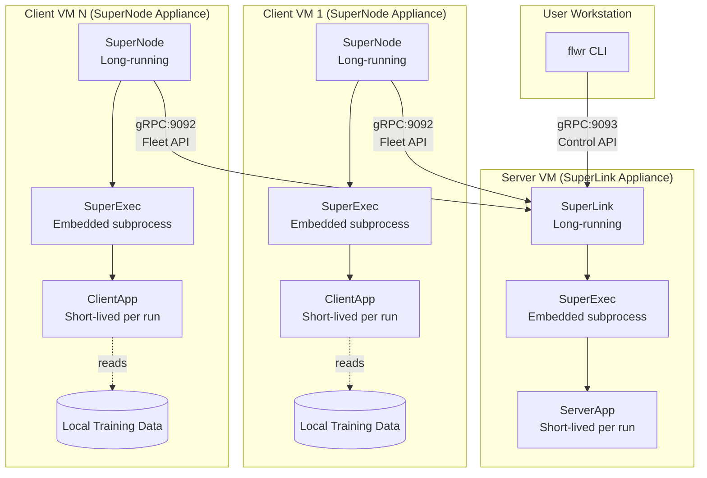

---

## 2. Communication Model

### 2.1 Ports and Protocols

**Confidence: HIGH** -- verified via official Flower network communication reference.

All Flower communication uses **gRPC** (HTTP/2 + Protocol Buffers).

| Port | API Name | Listener | Callers | Purpose |
|------|----------|----------|---------|---------|
| **9091** | ServerAppIo API | SuperLink | SuperExec (server-side), ServerApp | Internal server-side coordination. Model weight distribution. |
| **9092** | Fleet API | SuperLink | SuperNode(s) | Client-to-server communication. Task assignment, result collection. **Primary cross-network port.** |
| **9093** | Control API | SuperLink | flwr CLI, user tools | Run management, monitoring, SuperNode registration. |
| **9094** | ClientAppIo API | SuperNode | SuperExec (client-side), ClientApp | Internal client-side coordination. Local only in subprocess mode. |

### 2.2 Connection Direction (Critical for Firewall/NAT)

**All connections are client-initiated, outbound-only.** This is the single most important networking fact for the architecture:

```
SuperNode --[initiates]--> SuperLink:9092  (Fleet API)
CLI       --[initiates]--> SuperLink:9093  (Control API)
ServerApp --[initiates]--> SuperLink:9091  (ServerAppIo, local in subprocess mode)
ClientApp --[initiates]--> SuperNode:9094  (ClientAppIo, local in subprocess mode)
```

**Implication for OpenNebula:** The SuperLink VM needs inbound rules on ports 9092 and 9093. SuperNode VMs need only outbound access to the SuperLink. No inbound ports are required on client VMs from the Flower protocol perspective. This is NAT-friendly -- clients behind NAT can connect to a publicly-addressed SuperLink.

### 2.3 Message Flow Pattern

Flower uses a **pull-based message exchange** model, not push:

1. **SuperNode polls SuperLink** via Fleet API for pending tasks
2. SuperLink responds with task instructions (e.g., "train model with these weights")
3. SuperNode executes the task locally via ClientApp
4. **SuperNode pushes results** back to SuperLink via Fleet API
5. ServerApp aggregates results when sufficient responses arrive

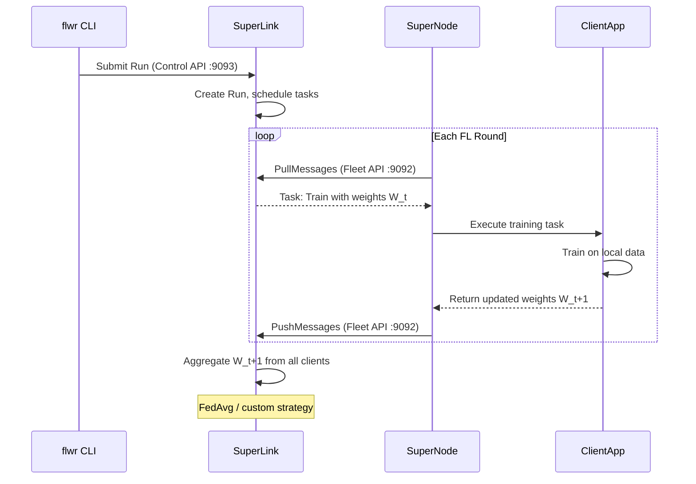

### 2.4 Large Model Transfer

As of Flower 1.20+, messages exceeding gRPC's default size limit are **automatically chunked**. The previous 2 GB gRPC limit is handled transparently. Extended TTL of 12 hours accommodates slow training rounds.

**Confidence: HIGH** -- verified in Flower changelog and release notes.

---

## 3. Security Model

### 3.1 TLS Configuration

**Confidence: HIGH** -- verified via official Flower TLS documentation.

Flower uses a **CA-based TLS model** where the SuperLink presents a server certificate and clients verify it against a shared CA certificate.

#### Certificate Requirements

| Certificate | Held By | Purpose |
|-------------|---------|---------|
| `ca.crt` | SuperLink, all SuperNodes, CLI | Root of trust. Verifies SuperLink identity. |
| `server.pem` | SuperLink only | Server identity + encryption |
| `server.key` | SuperLink only | Private key for decryption |

#### Launch Commands with TLS

```bash
# SuperLink (server)
flower-superlink \
  --ssl-ca-certfile /certs/ca.crt \
  --ssl-certfile /certs/server.pem \
  --ssl-keyfile /certs/server.key

# SuperNode (client)
flower-supernode \
  --root-certificates /certs/ca.crt \
  --superlink <superlink-ip>:9092
```

#### Trust Model

- **Unidirectional:** Clients verify server. Server does not verify individual client certificates via TLS.
- **Client authentication** is handled separately via SuperNode authentication (see below), not via mTLS.
- **Internal connections** (SuperExec to SuperLink within same trusted network/VM) can remain unencrypted in subprocess mode.

### 3.2 SuperNode Authentication

**Confidence: HIGH** -- verified via official Flower authentication documentation.

Two modes exist, layered on top of TLS (authentication requires TLS):

| Mode | How It Works | Security Level |
|------|-------------|----------------|
| **Automatic** | SuperLink validates timestamp-based ECDSA signatures. Prevents impersonation/replay. But **any SuperNode can connect**. | Medium -- identity verified, but no access control. |
| **CLI-Managed** | SuperLink launched with `--enable-supernode-auth`. Each SuperNode's public key must be pre-registered via `flwr supernode register`. Only whitelisted SuperNodes connect. | High -- explicit enrollment required. |

#### Key Management Workflow

```bash
# 1. Generate key pair for a SuperNode
#    (use generate_auth_keys.sh or organizational PKI)

# 2. Register the SuperNode's public key with SuperLink
flwr supernode register keys/client_1.pub . my-federation

# 3. Launch SuperNode with its private key
flower-supernode \
  --root-certificates /certs/ca.crt \
  --auth-supernode-private-key keys/client_1.key \
  --superlink <superlink-ip>:9092

# 4. Verify registration
flwr supernode list . my-federation
```

### 3.3 Security Architecture for OpenNebula

**Recommendation:** Use CLI-managed authentication for production multi-tenant deployments. The architecture should:

1. **Generate a CA per federation** during OneFlow service instantiation (or accept user-provided CA)
2. **Embed CA cert in all appliances** via contextualization
3. **Generate per-SuperNode key pairs** during SuperNode VM boot (contextualization script)
4. **Auto-register SuperNode keys** with SuperLink via OneGate coordination or a bootstrap script
5. **Distribute server cert** to SuperNode VMs via contextualization parameters

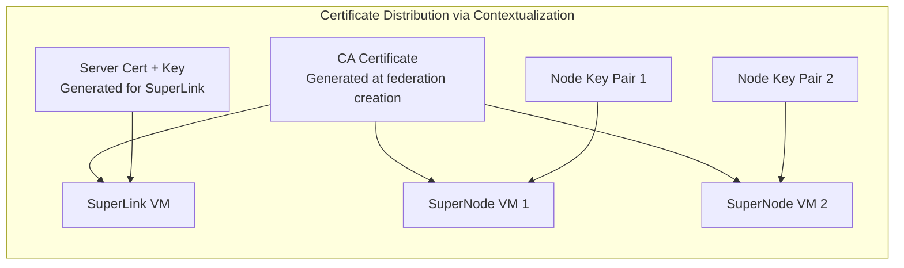

---

## 4. Mapping to OpenNebula Primitives

### 4.1 Appliance-to-Component Mapping

**Confidence: MEDIUM** -- based on OpenNebula documentation patterns and Flower architecture; specific integration is novel.

| Flower Component | OpenNebula Primitive | Rationale |
|-----------------|---------------------|-----------|
| SuperLink + ServerApp | **VM Appliance** (QCOW2 marketplace image) | Long-running, single instance. Needs stable IP/hostname. Moderate compute (aggregation). |
| SuperNode + ClientApp | **VM Appliance** (QCOW2 marketplace image) | Long-running, multiple instances. Needs GPU for training. Scales horizontally. |
| Federation (server + N clients) | **OneFlow Service Template** | Multi-role orchestration with dependency ordering. Server role deploys first, client role scales. |
| Configuration (certs, endpoints, ML code) | **Contextualization** | Inject CA certs, SuperLink address, auth keys, and FL project code at boot time. |
| Distribution | **Marketplace Appliance** | Publish pre-built QCOW2 images with Flower pre-installed. Tenants instantiate via OneFlow. |

### 4.2 OneFlow Service Template Structure

The OneFlow service template defines the federation as a multi-role service with deployment dependencies:

```json
{
  "name": "flower-federation",
  "deployment": "straight",
  "description": "Flower Federated Learning Federation",
  "roles": [
    {
      "name": "superlink",
      "type": "vm",
      "cardinality": 1,
      "min_vms": 1,
      "max_vms": 1,
      "template_id": "<SUPERLINK_TEMPLATE_ID>",
      "template_contents": "CONTEXT = [\n  TOKEN = \"YES\",\n  NETWORK = \"YES\",\n  FL_ROLE = \"server\",\n  FL_TLS_ENABLED = \"$FL_TLS_ENABLED\",\n  FL_CA_CERT = \"$FL_CA_CERT\",\n  FL_SERVER_CERT = \"$FL_SERVER_CERT\",\n  FL_SERVER_KEY = \"$FL_SERVER_KEY\"\n]"
    },
    {
      "name": "supernode",
      "type": "vm",
      "cardinality": 2,
      "min_vms": 1,
      "max_vms": 50,
      "template_id": "<SUPERNODE_TEMPLATE_ID>",
      "template_contents": "CONTEXT = [\n  TOKEN = \"YES\",\n  NETWORK = \"YES\",\n  FL_ROLE = \"client\",\n  FL_SUPERLINK_ADDRESS = \"${superlink.TEMPLATE.CONTEXT.ETH0_IP}:9092\",\n  FL_CA_CERT = \"$FL_CA_CERT\",\n  FL_NODE_AUTH_ENABLED = \"$FL_NODE_AUTH_ENABLED\"\n]",
      "elasticity_policies": [
        {
          "type": "CHANGE",
          "adjust": 1,
          "cooldown": 300,
          "period": 120,
          "expression": "FL_NEED_MORE_CLIENTS > 0"
        }
      ]
    }
  ],
  "networks_values": [
    {
      "FL Network": {
        "template_id": "<VNET_TEMPLATE_ID>"
      }
    }
  ],
  "user_inputs": {
    "FL_TLS_ENABLED": "M|boolean|Enable TLS||YES",
    "FL_CA_CERT": "O|text|CA Certificate (PEM)||",
    "FL_SERVER_CERT": "O|text|Server Certificate (PEM)||",
    "FL_SERVER_KEY": "O|text|Server Private Key (PEM)||",
    "FL_NODE_AUTH_ENABLED": "M|boolean|Enable SuperNode Auth||YES",
    "FL_PROJECT_URL": "O|text|Git URL for FL project code||",
    "FL_NUM_CLIENTS": "M|number|Number of training clients||2"
  }
}
```

**Key design decisions:**

1. **`deployment: "straight"`** -- SuperLink role deploys first. SuperNode role waits until SuperLink is RUNNING. This ensures clients have a server to connect to.

2. **Parent reference `${superlink.TEMPLATE.CONTEXT.ETH0_IP}`** -- SuperNode VMs automatically discover the SuperLink's IP address through OneFlow's parent-child attribute inheritance.

3. **Elasticity policies** on the SuperNode role -- enable auto-scaling of training clients based on workload demand.

4. **`TOKEN = "YES"`** -- enables OneGate integration for inter-VM communication beyond what contextualization provides.

### 4.3 OneGate for Service Discovery and Coordination

OneGate provides the runtime coordination layer that contextualization alone cannot:

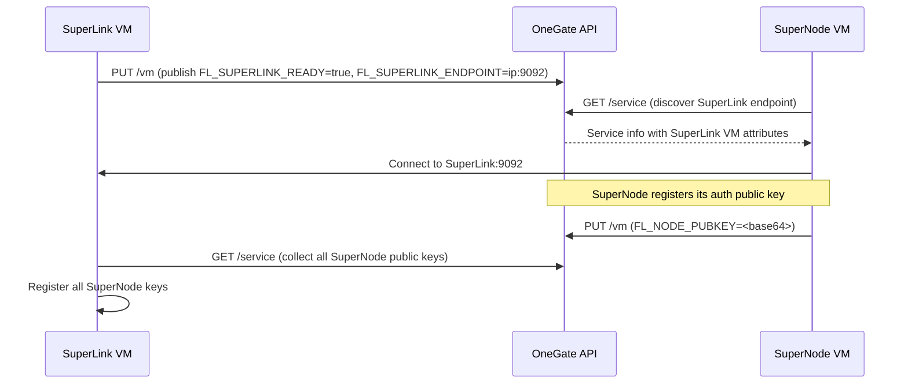

**OneGate use cases in the FL architecture:**

| Use Case | OneGate Operation | Why |
|----------|------------------|-----|
| SuperLink readiness | SuperLink VM PUTs `FL_READY=true` | SuperNodes wait for readiness before connecting |
| Endpoint discovery | SuperNodes GET `/service` | Discover SuperLink IP dynamically (backup to contextualization) |
| Auth key exchange | SuperNodes PUT public key; SuperLink GETs all keys | Automate SuperNode registration without manual CLI steps |
| Training status | ServerApp PUTs round/accuracy metrics | External monitoring without Flower-internal APIs |
| Health signaling | SuperNodes PUT heartbeat | OneFlow elasticity can react to node failures |

### 4.4 Contextualization Script Architecture

Each appliance image includes service scripts following the one-apps convention:

```
/etc/one-appliance/service
    |-- configure        # Stage 1: System configuration
    |-- bootstrap        # Stage 2: Service-specific setup
    |-- flower-server    # Custom: SuperLink startup
    |-- flower-client    # Custom: SuperNode startup
```

**Configure stage** (runs on first boot):
1. Read context variables (`FL_ROLE`, `FL_TLS_ENABLED`, etc.)
2. Install/update Flower packages if `FL_FLOWER_VERSION` specified
3. Write TLS certificates to `/etc/flower/certs/` from context variables
4. Configure systemd service files based on role

**Bootstrap stage** (runs after configure):
1. If `FL_ROLE=server`: Start SuperLink with TLS flags, wait for readiness, publish to OneGate
2. If `FL_ROLE=client`: Query OneGate for SuperLink endpoint, generate auth keys, register with SuperLink, start SuperNode
3. If `FL_PROJECT_URL` set: Clone FL project repository for ServerApp/ClientApp code

---

## 5. Deployment Topologies

### 5.1 Topology 1: Single-Site

All components on the same OpenNebula cloud. Simplest case.

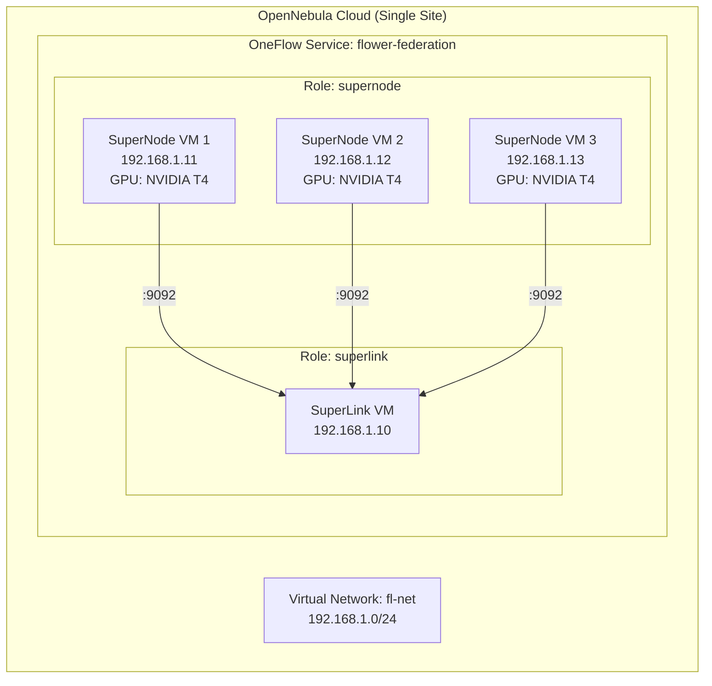

**Networking:** Single virtual network. All VMs can reach each other directly. OneFlow manages deployment ordering.

**OpenNebula mapping:**
- 1 OneFlow Service Template
- 2 VM Templates (server, client)
- 1 Virtual Network
- OneGate for service discovery

### 5.2 Topology 2: Multi-Site Federated

Server on one OpenNebula zone, clients across multiple zones. This is the primary use case for privacy-preserving FL.

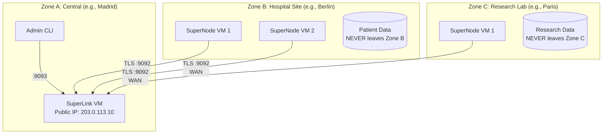

**Networking requirements:**
- SuperLink needs a **publicly routable IP** or VPN endpoint reachable from all zones
- SuperNodes need **outbound HTTPS/gRPC access** to SuperLink:9092 (client-initiated -- NAT-friendly)
- **No inbound connections required on client VMs** from Flower's perspective
- TLS is **mandatory** for cross-zone communication
- SuperNode authentication (CLI-managed) is **strongly recommended** to prevent unauthorized nodes

**OpenNebula mapping:**
- Each zone has its own OpenNebula instance (potentially federated via OpenNebula Zones)
- Zone A: OneFlow Service Template with SuperLink role only
- Zone B, C: OneFlow Service Template with SuperNode role only, configured with Zone A's SuperLink endpoint
- Alternatively: Standalone VM templates per zone (simpler if zones are independently managed)

**Critical consideration:** OpenNebula federation shares user/group databases but keeps VM management zone-local. This means Zone B's admin can instantiate SuperNode templates but cannot see Zone A's SuperLink VMs directly. Coordination happens through:
1. Contextualization parameters (SuperLink endpoint injected at instantiation)
2. OneGate is zone-local, so cross-zone service discovery must use explicit configuration or external DNS

### 5.3 Topology 3: Telco Edge

Clients on 5G edge nodes (small, potentially GPU-less), server centralized.

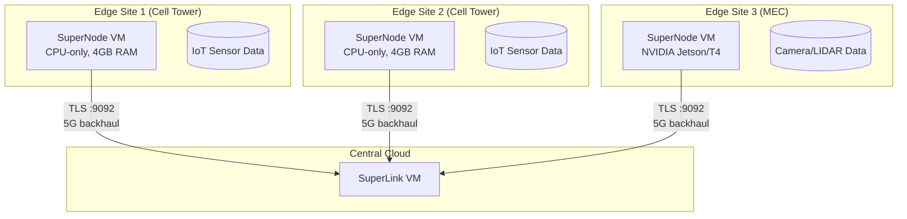

**Edge-specific considerations:**
- **Bandwidth constraints:** Flower's gRPC/Protobuf is efficient, but large model weights still transfer each round. Consider model compression strategies in ServerApp.
- **Intermittent connectivity:** Flower's pull-based model tolerates clients going offline. The Strategy abstraction can be configured to proceed with a subset of clients (e.g., `min_fit_clients < total_clients`).
- **Resource constraints:** Edge SuperNode VMs may be CPU-only. ClientApp code must handle graceful CPU fallback.
- **12-hour TTL:** Flower's extended message TTL accommodates slow edge training rounds.

### 5.4 Topology 4: Hybrid Cloud + Edge

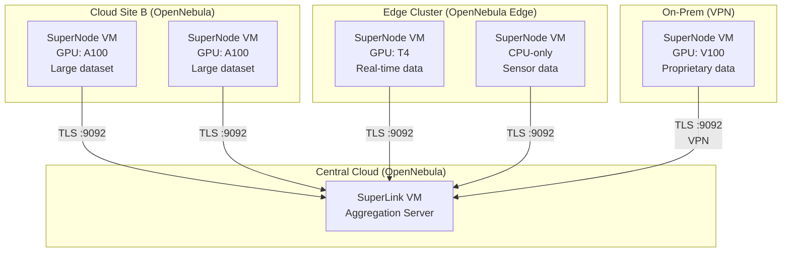

**This topology demonstrates Flower's key strength:** heterogeneous clients with different hardware, data sizes, and network conditions can all participate in the same federation because the protocol is uniform (gRPC pull-based) and the Strategy abstraction handles stragglers.

---

## 6. Data Flow

### 6.1 What Moves vs. What Stays

This is the fundamental privacy guarantee of federated learning:

| Data Type | Moves? | Direction | Size |
|-----------|--------|-----------|------|
| **Training data** | **NEVER** | Stays on SuperNode VM | Varies (GB-TB) |
| **Model weights** (global) | Yes | SuperLink --> SuperNodes | Model-dependent (MB-GB) |
| **Model updates** (gradients/weights) | Yes | SuperNodes --> SuperLink | Same as model weights |
| **Hyperparameters** | Yes | SuperLink --> SuperNodes | Tiny (KB) |
| **Evaluation metrics** | Yes | SuperNodes --> SuperLink | Tiny (KB) |
| **FL project code** (FAB) | Yes | SuperLink --> SuperNodes | Small (KB-MB) |
| **Aggregated model** | Yes | SuperLink --> storage/user | Model-dependent (MB-GB) |

### 6.2 Per-Round Data Flow

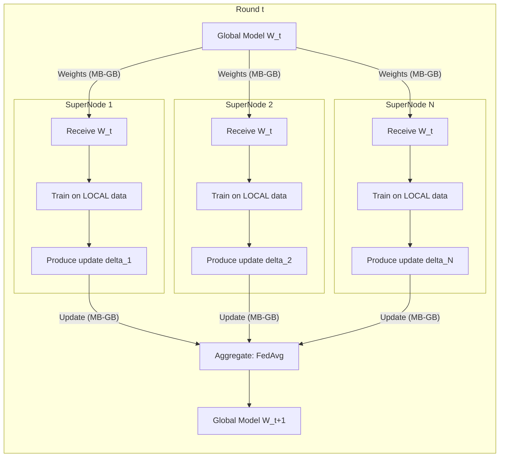

### 6.3 Bandwidth Estimation

For a concrete example with a ResNet-50 model (~100MB):

| Phase | Per-Client | N=10 Clients | N=100 Clients |
|-------|-----------|--------------|---------------|
| Distribute weights | 100 MB out | 1 GB out | 10 GB out |
| Collect updates | 100 MB in | 1 GB in | 10 GB in |
| **Per round total** | 200 MB | 2 GB | 20 GB |
| **100 rounds total** | 20 GB | 200 GB | 2 TB |

**Implication for OpenNebula:** SuperLink VM needs substantial network bandwidth. For large federations, consider:
- Co-locating SuperLink in a well-connected datacenter
- Using model compression/quantization in ServerApp
- Flower's automatic message chunking handles the gRPC transport layer

### 6.4 Training Data Locality

Training data must be pre-positioned on SuperNode VMs. Options for the OpenNebula architecture:

| Approach | How | When to Use |
|----------|-----|-------------|
| **Baked into image** | Include dataset in QCOW2 appliance image | Demo/testing; small, public datasets |
| **Attached volume** | Attach OpenNebula datastore volume to SuperNode VM | Production; data already in the cloud |
| **NFS/S3 mount** | Mount external storage inside VM via contextualization | Data in existing enterprise storage |
| **Download on boot** | Contextualization script downloads from URL | Medium datasets, reproducible setups |
| **Already present** | Data exists on tenant's infrastructure; appliance mounts local path | Most realistic production scenario |

---

## 7. GPU and Compute Architecture

### 7.1 GPU Passthrough for Training Clients

**Confidence: HIGH** -- verified via OpenNebula 7.0 NVIDIA GPU documentation.

SuperNode VMs performing model training benefit significantly from GPU acceleration. OpenNebula supports two approaches:

| Approach | Performance | Sharing | Use Case |
|----------|------------|---------|----------|
| **PCI Passthrough** | Near bare-metal | 1 GPU = 1 VM | Training (maximum performance) |
| **vGPU (NVIDIA GRID)** | ~90% bare-metal | 1 GPU = N VMs | Inference, light training |

#### GPU-Enabled SuperNode VM Template

```
NAME = "flower-supernode-gpu"
CPU = "16"
VCPU = "16"
MEMORY = "65536"

OS = [
    ARCH = "x86_64",
    FIRMWARE = "UEFI"
]

FEATURES = [
    MACHINE = "q35"
]

CPU_MODEL = [
    MODEL = "host-passthrough"
]

TOPOLOGY = [
    PIN_POLICY = "CORE",
    CORES = "16",
    SOCKETS = "1"
]

PCI = [
    SHORT_ADDRESS = "e1:00.0"
]

CONTEXT = [
    TOKEN = "YES",
    NETWORK = "YES",
    FL_ROLE = "client",
    FL_SUPERLINK_ADDRESS = "$FL_SUPERLINK_ADDRESS",
    FL_CA_CERT = "$FL_CA_CERT"
]
```

**Key requirements:**
- UEFI firmware (modern GPUs require it)
- q35 machine type (PCIe-based chipset)
- CPU host-passthrough (GPU initialization needs advanced CPU instructions)
- CPU pinning with NUMA awareness (scheduler co-locates vCPUs with GPU on same NUMA node)
- IOMMU enabled on host, GPU bound to vfio-pci driver

### 7.2 Compute Sizing Guidelines

| Role | CPU | RAM | GPU | Storage | Notes |
|------|-----|-----|-----|---------|-------|
| SuperLink | 4-8 vCPU | 8-16 GB | None | 50 GB | Aggregation is CPU-bound |
| SuperNode (training) | 8-16 vCPU | 32-64 GB | 1x T4/A100 | 100+ GB | GPU for training, storage for data |
| SuperNode (edge/CPU) | 2-4 vCPU | 4-8 GB | None | 20 GB | Lightweight, CPU-only training |
| SuperNode (inference) | 4-8 vCPU | 16-32 GB | 1x T4 (optional) | 50 GB | Evaluation workloads |

---

## 8. Observability Architecture

### 8.1 Built-in Flower Observability

**Confidence: MEDIUM** -- based on Flower documentation and blog posts; specifics of metrics format need verification.

| Capability | How | Access |
|-----------|-----|--------|
| **Log streaming** | `flwr log <run-id>` via Control API | CLI connected to SuperLink:9093 |
| **Log levels** | `FLWR_LOG_LEVEL` environment variable | Per-component configuration |
| **Metrics records** | `metrics_records` API in ServerApp | Programmatic access |
| **Run history** | Stored in SuperLink | Via Control API |

### 8.2 External Observability Stack

For production deployments, supplement Flower's built-in observability:

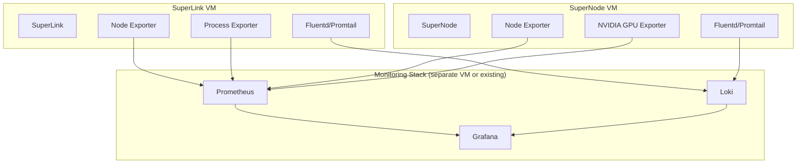

**Metrics to collect:**

| Metric | Source | Why |
|--------|--------|-----|
| FL round number, accuracy, loss | ServerApp (via OneGate or custom exporter) | Training progress |
| Active SuperNodes | SuperLink logs or Control API | Federation health |
| GPU utilization, memory | nvidia-smi / DCGM exporter | Training efficiency |
| Network I/O | Node exporter | Bandwidth monitoring |
| gRPC latency | SuperLink/SuperNode logs | Communication health |
| VM CPU/RAM | Node exporter | Resource planning |

---

## 9. Anti-Patterns to Avoid

### Anti-Pattern 1: Centralized Data Collection

**What:** Moving training data to a central server for "easier" processing.
**Why bad:** Defeats the entire purpose of federated learning. May violate GDPR, HIPAA, or other data sovereignty regulations.
**Instead:** Data stays on SuperNode VMs. Only model updates (weights/gradients) travel to the SuperLink.

### Anti-Pattern 2: Shared Filesystem Between Server and Clients

**What:** Using NFS or shared storage between SuperLink and SuperNode VMs for model exchange.
**Why bad:** Bypasses Flower's built-in secure communication. Breaks multi-site topology. Introduces single point of failure.
**Instead:** Use Flower's gRPC protocol for all model weight exchange. It handles serialization, chunking, and TLS automatically.

### Anti-Pattern 3: Fixed Client IP Configuration

**What:** Hardcoding SuperNode IP addresses in SuperLink configuration.
**Why bad:** Flower's architecture has clients connect to the server (not the reverse). SuperLink does not need to know client IPs. Hardcoding prevents dynamic scaling.
**Instead:** SuperNodes discover SuperLink via contextualization/OneGate. SuperLink simply listens.

### Anti-Pattern 4: Single VM for Everything

**What:** Running SuperLink and SuperNodes on the same VM for "simplicity."
**Why bad:** No fault isolation. No independent scaling. Defeats privacy guarantees (data is co-located). Cannot demonstrate multi-tenant scenarios.
**Instead:** Separate VMs per role, managed by OneFlow.

### Anti-Pattern 5: Skipping TLS for "Internal" Networks

**What:** Running without TLS because "all VMs are on the same virtual network."
**Why bad:** Model weights are valuable IP. Multi-tenant clouds have shared infrastructure. Network sniffing is possible. Violates EU-sovereign security expectations.
**Instead:** Always enable TLS. The performance overhead is negligible compared to training time.

### Anti-Pattern 6: Monolithic Appliance Image

**What:** Building one giant QCOW2 image with all ML frameworks, datasets, and tools pre-installed.
**Why bad:** Huge image size (10+ GB), slow marketplace download, impossible to update individual components.
**Instead:** Minimal base image with Flower + Python runtime. ML framework and project code injected via contextualization (pip install at boot or volume mount).

---

## 10. Build Order and Dependencies

### 10.1 Dependency Graph

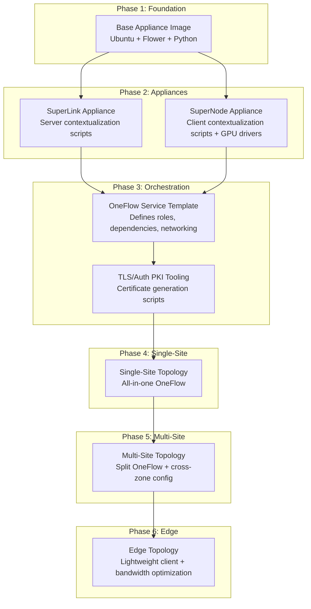

### 10.2 Build Order Rationale

| Phase | What to Build | Why This Order |
|-------|--------------|---------------|
| **1. Base Image** | QCOW2 with Ubuntu, Python, Flower framework, NVIDIA drivers, contextualization packages | Everything depends on having a working base image |
| **2. Role-Specific Appliances** | SuperLink and SuperNode appliance images with contextualization scripts (`/etc/one-appliance/service`) | Must specialize base image before orchestration can reference it |
| **3. Orchestration** | OneFlow service template + TLS/PKI automation | Cannot test the full flow without orchestration to wire components together |
| **4. Single-Site Validation** | Deploy and test on one OpenNebula cloud | Validates all components work end-to-end before adding network complexity |
| **5. Multi-Site** | Cross-zone deployment, VPN/public endpoint, split OneFlow templates | Adds real-world networking; builds on proven single-site |
| **6. Edge** | Lightweight client images, bandwidth optimization, intermittent connectivity handling | Most complex topology; builds on multi-site patterns |

### 10.3 Component Dependencies Matrix

| Component | Depends On | Blocks |
|-----------|-----------|--------|
| Base QCOW2 image | one-apps toolchain, Packer | All appliances |
| SuperLink appliance | Base image, contextualization scripts | OneFlow template, TLS tooling |
| SuperNode appliance | Base image, contextualization scripts, GPU drivers | OneFlow template |
| OneFlow service template | Both appliance template IDs | All deployment topologies |
| TLS/PKI automation | SuperLink appliance (to test with) | Secure deployments |
| OneGate integration | Both appliances (scripts), OneFlow service | Dynamic discovery, auth key exchange |
| Marketplace publishing | All appliances, OneFlow template | End-user self-service |

---

## Appendix A: Port Summary

Quick reference for firewall rules:

| Port | Protocol | Direction | Component | Required For |
|------|----------|-----------|-----------|-------------|
| 9091 | gRPC/TCP | Loopback only | SuperLink | ServerAppIo API (subprocess mode = local) |
| 9092 | gRPC/TCP | Inbound to SuperLink | SuperLink | Fleet API -- SuperNode connections |
| 9093 | gRPC/TCP | Inbound to SuperLink | SuperLink | Control API -- CLI management |
| 9094 | gRPC/TCP | Loopback only | SuperNode | ClientAppIo API (subprocess mode = local) |
| 443/custom | HTTPS | Outbound from SuperLink | OIDC provider | Optional: user authentication |

**Minimal firewall rules:**
- SuperLink VM: Allow inbound TCP 9092, 9093
- SuperNode VM: Allow outbound TCP to SuperLink:9092
- All VMs: Allow outbound to OneGate endpoint (if used)

## Appendix B: Flower Version Considerations

**Confidence: MEDIUM** -- license key situation needs direct verification.

| Version | Key Feature | Relevance |
|---------|-------------|-----------|
| 1.20+ | Automatic message chunking (>2GB models) | Large model support |
| 1.20+ | License key for Helm/Deployment Engine | May affect Kubernetes deployment path |
| 1.23+ | `flwr supernode register/list/unregister` CLI | Simplified auth key management |
| 1.26 | Current stable | Recommended starting point |

**License key clarification:** The Apache-2.0 open-source framework is free. The license key requirement appears to apply specifically to the Helm chart's Deployment Engine mode (SuperLink docker image in Kubernetes). For VM-based deployments using `flower-superlink` and `flower-supernode` CLI commands directly, no license key is needed. **This needs verification before finalizing the architecture -- flag for Phase 1 research.**

## Appendix C: Sources

### Flower Framework (HIGH confidence)
- [Flower Architecture](https://flower.ai/docs/framework/explanation-flower-architecture.html)
- [Flower Network Communication](https://flower.ai/docs/framework/ref-flower-network-communication.html)
- [Enable TLS Connections](https://flower.ai/docs/framework/how-to-enable-tls-connections.html)
- [Authenticate SuperNodes](https://flower.ai/docs/framework/how-to-authenticate-supernodes.html)
- [Deploy on Multiple Machines with Docker](https://flower.ai/docs/framework/docker/tutorial-deploy-on-multiple-machines.html)
- [Docker Compose Reference](https://github.com/adap/flower/blob/main/framework/docker/complete/compose.yml)
- [Deploy SuperLink using Helm](https://flower.ai/docs/framework/helm/how-to-deploy-superlink-using-helm.html)
- [Configure Logging](https://flower.ai/docs/framework/how-to-configure-logging.html)
- [Flower Changelog](https://flower.ai/docs/framework/ref-changelog.html)

### OpenNebula (HIGH confidence)
- [OneFlow Services Management (7.0)](https://docs.opennebula.io/7.0/product/virtual_machines_operation/multi-vm_workflows/appflow_use_cli/)
- [NVIDIA GPU Passthrough (7.0)](https://docs.opennebula.io/7.0/product/cluster_configuration/hosts_and_clusters/nvidia_gpu_passthrough/)
- [KVM Contextualization (7.0)](https://docs.opennebula.io/7.0/product/virtual_machines_operation/guest_operating_systems/kvm_contextualization/)
- [Managing Marketplace Appliances (7.0)](https://docs.opennebula.io/7.0/product/apps-marketplace/managing_marketplaces/marketapps/)
- [OneGate API](https://docs.opennebula.io/6.10/integration_and_development/system_interfaces/onegate_api.html)
- [OpenNebula Federation](https://opennebula.io/blog/innovation/federating-opennebula-clouds/)
- [one-apps GitHub Repository](https://github.com/OpenNebula/one-apps/)

### Integration/Community (MEDIUM confidence)
- [ICOS FL Docker Setup](https://icos-fl.readthedocs.io/en/latest/how_to/deployment/docker_setup.html)
- [Flower + NVIDIA FLARE Integration](https://developer.nvidia.com/blog/supercharging-the-federated-learning-ecosystem-by-integrating-flower-and-nvidia-flare/)
- [GPU and vGPU in OpenNebula Blog](https://opennebula.io/blog/product/gpu-and-vgpu-in-opennebula/)
- [Flower Datasets Partitioning](https://flower.ai/docs/datasets/tutorial-use-partitioners.html)
